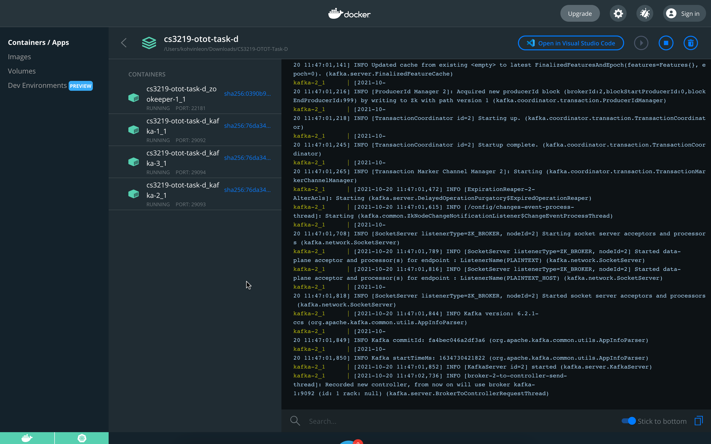
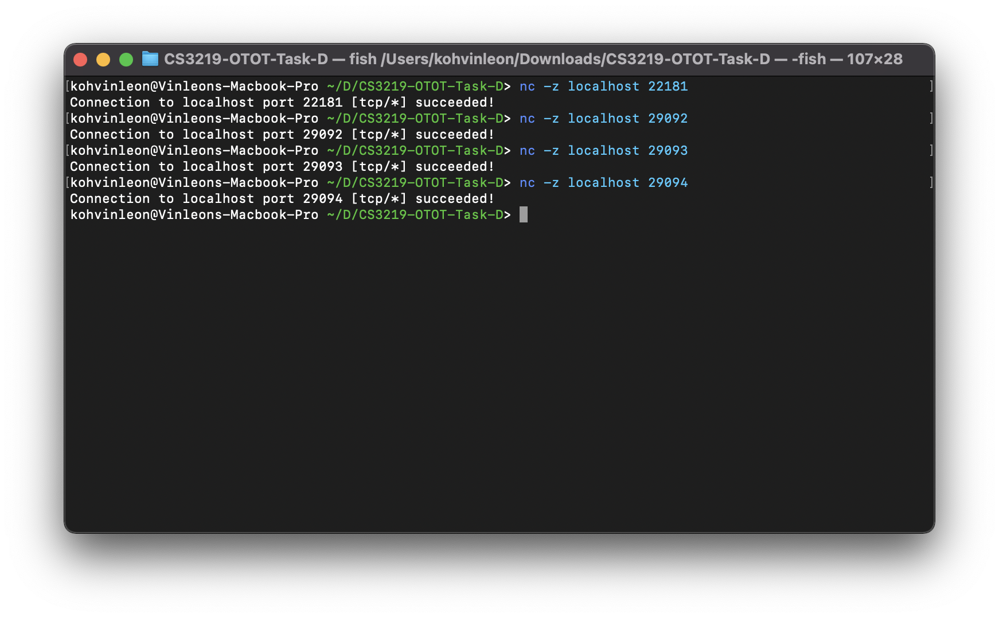
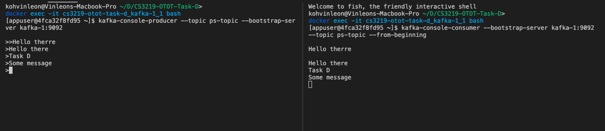
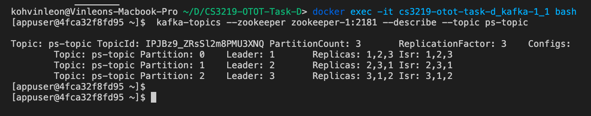
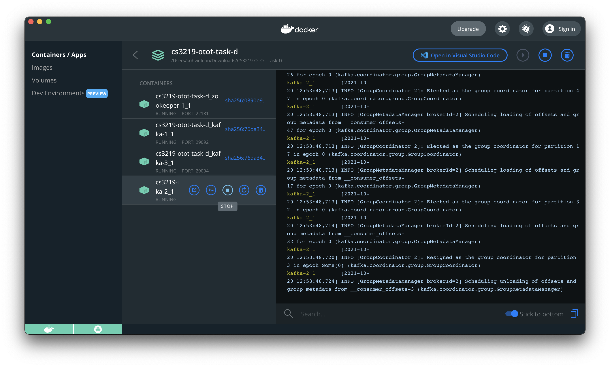
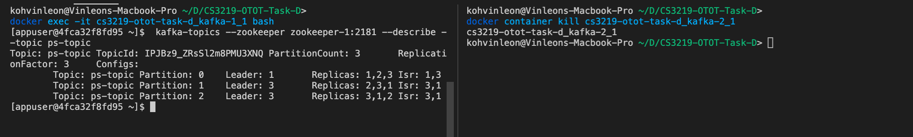

# CS3219 Task D: Pub-Sub Messaging
**Name**: Koh Vinleon <br/>
**Matric Number**: A0202155W <br/>
**GitHub Link**: [https://github.com/glatiuden/CS3219-OTOT-TaskD](https://github.com/glatiuden/CS3219-OTOT-TaskD)

## Set Up Instructions
All the configuration has been set in `docker-compose.yml` in the same directory.

To build the Docker images and run the containers, execute the following command:
```bash
docker-compose up -d
```

The docker images should be created, and containers should start running.


In addition, we can verify whether are the servers listening to the port by executing:
```bash
nc -z localhost 22181
nc -z localhost 29092
nc -z localhost 29093
nc -z localhost 29094
```



## Pub/Sub

To start off, we need to create a topic within our Kakfa container.
To run commands in our Kakfa container, we can execute:
```bash
docker exec -it cs3219-otot-task-d_kafka-1_1 bash
```

Upon executing, you should be running bash within the container.

#### Topic
We need a topic before we can demonstrate the Pub/Sub messaging capability. We will be creating a topic called `ps-topic` for this demonstration with this command:
```bash
kafka-topics --create --topic ps-topic --partitions 3 --replication-factor 3 --zookeeper zookeeper-1:2181
```

The command prompt/terminal should output
```bash
Created topic ps-topic.
```

### Producer
Now, we will be entering the producer console.

If you have exited the bash terminal within the Kakfa container, please refer to [Pub/Sub](#Pub/Sub) to execute the command again.

To enter the producer console, we can execute
```bash
kafka-console-producer --topic ps-topic --bootstrap-server kafka-1:9092
```

### Consumer
Now, we will be entering the consumer console. For demonstration purpose, please open a separate command prompt/terminal forr the following instructions this while maintaining the producer console as connected.

Please refer to [Pub/Sub](#Pub/Sub) to connect to Kafka's container bash.

To enter the producer console, we can execute
```bash
kafka-console-consumer --bootstrap-server kafka-1:9092 --topic ps-topic --from-beginning
```

### Demonstration
Please ensure you have both [Producer](#Producer) and [Consumer](#Consumer) console running. For the demonstration, you can enter any message in the producer console and it should reflect on the consumer's console instanteously.



## Successful management of the failure of the master node in the cluster

If you are continuing from the previous section, you may stop either one of the producer or consumer console by pressing `Ctrl + C`, otherwise open a new terminal and follow the instructions [here](#Pub/Sub).

Commands to be executed are in the Kafka's container bash terminal otherwise stated.

First, we can view the master (or leader) nodes of each partition to see the before and after. To do this, we can run:
```bash
kafka-topics --zookeeper zookeeper-1:2181 --describe --topic ps-topic
```



As we can see here, node 1 is the master (or leader) for partition 0, node 2 for partition 1 and node 3 for partition 2. 

To demonstrate the "failure" event, we will be killing one of the Kafka's node. You may kill any nodes of your choice. For this demonstration, we will be killing node 2, named `cs3219-otot-task-d_kafka-2_1`.

You may kill the node via the Docker Desktop GUI by pressing stop button:


...or open another terminal/command prompt (on your desktop, not in Kafka's container), and execute:
```bash
docker container kill cs3219-otot-task-d_kafka-2_1
```

Once the node has stop, we can run `kafka-topics --zookeeper zookeeper-1:2181 --describe --topic ps-topic` once again to see which node tookover as master for partition 1.



We can see that node 3 has became the leader for partition 1, successfully taking over as the master node when node 2 was killed.

<div style="page-break-after: always;"></div>

**References**
- [https://www.baeldung.com/ops/kafka-docker-setup/](https://www.baeldung.com/ops/kafka-docker-setup/)
- [https://kafka-tutorials.confluent.io/kafka-console-consumer-producer-basics/kafka.html](https://kafka-tutorials.confluent.io/kafka-console-consumer-producer-basics/kafka.html)
- [https://medium.com/big-data-engineering/hello-kafka-world-the-complete-guide-to-kafka-with-docker-and-python-f788e2588cfc](https://medium.com/big-data-engineering/hello-kafka-world-the-complete-guide-to-kafka-with-docker-and-python-f788e2588cfc)
